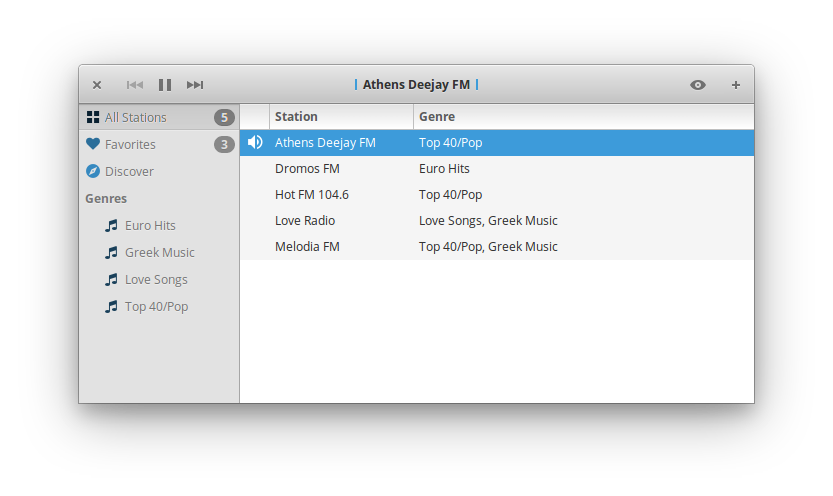

<p align="center">
    
</p>

<h1 align="center">eRadio</h1>
<p align="center">A minimalist and powerful radio player for elementary OS</p>

<p align="center">
    
</p>

## Developing and building

Development is targeted at [elementary OS] Juno. If you want to hack on and
build eRadio yourself, you'll need the following dependencies:

- gstreamer-1.0
- gtk+-3.0
- granite
- sqlite3
- gee-0.8
- libnotify
- json-glib-1.0
- libsoup-2.4
- libxml-2.0
- sqlheavy-0.1

You can install them on elementary OS Juno with:

```shell
sudo apt install elementary-sdk
```

Run `meson build` to configure the build environment and run `ninja install`
to install:

```shell
meson build --prefix=/usr
cd build
sudo ninja install
```

Then run it with:

```shell
com.github.dreamdevel.eradio
```

[elementary OS]: https://elementary.io